---
format:
  revealjs:
    self-contained: true
    spotlight: true
    touch: true
    controls: true
    pointer: true
    center-title-slide: false
    transition: fade
    transition-speed: fast
    scrollable: true
    slide-number: true
    incremental: false
    multiplex: false
    chalkboard: false
    smaller: true
    theme: [custom.scss]
    filters:
     - highlight-text
bibliography: references-hemeinfect.bib
lightbox: true
csl: diagnostic-microbiology-and-infectious-disease.csl
editor: 
  markdown: 
    wrap: 72
---

# Infections in Patients with Hemtalogical Malignancies {background-color="#b20e10"}

<br> <br>

<center>**Russell E. Lewis** <br> Associate Professor of Infectious
Diseases <br> Department of Molecular Medicine <br> University of
Padua</center>

<br>

{fig-align="center" width="350"}

<center>

<br>  russelledward.lewis\@unipd.it
<br> 
[https://github.com/Russlewisbo](https://github.com/Russlewisbo/ESCMID_2022_talk)

## Objectives

<br>

- What are the most common infections associated with short versus
  prolonged neutropenia?

- What are the unique risks of infection associated with targeted
  therapies?

- How does the presentation of skin, mucocutaneous lesions, abdominal
  pain or pneumonia change the infection differential diagnosis?

- What are common empiric antimicrobial regimens used to treat patients
  while awaiting diagnostic results?

## Agenda

<br>

- Classic infection risk factors and management
- Current role of fluoroquinolone prophylaxis
- What is the impact of new targeted therapies on infection risk?
- Pneumonia and invasive fungal diseases

::: callout-note
Will focus mostly on epidemiology and general management principles \>
specific drug therapy.
:::

------------------------------------------------------------------------

## Effects of chemotherapy on hematopoiesis

<br>

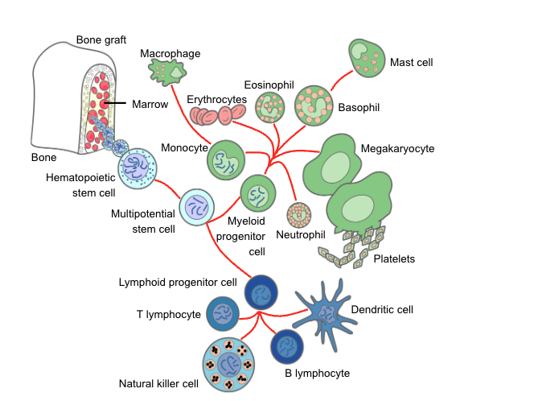{fig-align="center" width="350"}

Virtually all antineoplastic agents impair proliferation of
hematopoietic progenitor cells, resulting in dose-limiting **anemia**,
**thrombocytopenia** and **neutropenia**.

::::: columns
::: {.column width="50%"}
**Neutrophils**

- Short-lived, post-mitotic cells
- Continuously repopulated
- Complete re-population 14--21 days after chemotherapy
:::

::: {.column width="50%"}
**Lymphocytes**

- Heterogeneous --- short- and long-lived cells
- Considerable mitotic expansion
- Restoration of heterogeneous populations and T-cell competence is slow
  and often incomplete
:::
:::::

------------------------------------------------------------------------

## Causes of death at the dawn of the <br>chemotherapy era for leukemia

<br>

| Parameter          | 1954-- <br>1959, n (%) | 1960-- <br>1963, n(%) | *p*     |
|------------------|------------------|------------------|------------------|
| Patients           | 184                    | 170                   |         |
| Hemorrhage alone   | 40 (22)                | 25 (14)               | \<0.001 |
| Infection alone    | 45 (24)                | 80 (44)               | \<0.001 |
| Infections (total) | 124 (67)               | 131 (71)              | NS      |
| *S. aureus*        | 30 (24)                | 6 (5)                 | \<0.001 |
| *E. coli*          | 27 (22)                | 17 (13)               | NS      |
| *Klebsiella* spp.  | 9 (7)                  | 16 (12)               | NS      |
| *P. aeruginosa*    | 31 (25)                | 45 (34)               | NS      |
| Fungi              | 10 (8)                 | 30 (23)               | \<0.001 |
| Other              | 24 (13)                | 23 (12)               | NS      |

<br>

- 47% of patients died with or from infection
- *S. aureus* bacteremia mortality: 62%
- *P. aeruginosa* bacteremia mortality: 100%

::: aside
[@hersh1965; @bodey2009history; @raab1960]
:::

------------------------------------------------------------------------

## Fungal infections at the dawn of the chemotherapy era

<br>

**Insights from autopsy studies**

- 189 fungal infections in 161/454 patients (35%)
- Most infections diagnosed *after* death
- 127 invasive fungal infections:
  - Invasive candidiasis (n = 73)
  - Aspergillosis (n = 38)
  - Mucormycosis (n = 6)

**Risk factors:** prolonged neutropenia, corticosteroids.

::: aside
[@bodey1966fungal; @bodey2009history]
:::

------------------------------------------------------------------------

## The vanishing medical autopsy

<br>

{fig-align="center"}

**Autopsy rates over two decades --- M.D. Anderson Cancer Center**

- 1989--1993: 63%
- 2004--2008: **6%**
- In 2004--2008, **45%** of patients with proven aspergillosis at
  autopsy had persistently negative galactomannan results.

::: aside
[@chamilos2006; @lewis2013]
:::

------------------------------------------------------------------------

## Available antibiotics at the dawn of the chemotherapy era

<br>

::: callout-warning
**No effective agents for *Pseudomonas aeruginosa*!**
:::

::::: columns
::: {.column width="50%"}
- Penicillin G
- Erythromycin
- Chloramphenicol
- Tetracyclines
- Polymyxins
- Neomycin
:::

::: {.column width="50%"}
- Streptomycin
- Kanamycin
- Vancomycin
- Ristocetin
- Novobiocin
- Sulfas
:::
:::::

## Prevalent attitudes in hematology wards in the 1960s

<br>

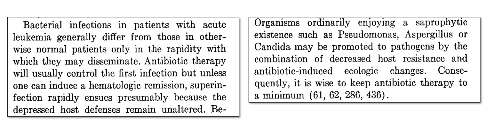{fig-align="center"}

"It is useless to aggressively treat infections if the leukemia patient
is not in remission."

::: aside
[@boggs1962]
:::

## Impact of carbenicillin on *P. aeruginosa* septicaemia <br> in leukemic patients

<br>

<center>**MD Anderson Cancer Center, Houston, Texas USA** <br></center>

<br> <br>

| Clinical presentation  | 1965--68 Cure (%) | 1972--81 Cure (%) |
|------------------------|-------------------|-------------------|
| Overall                | 21                | 62                |
| Shock                  | 0                 | 25                |
| Pneumonia              | 0                 | 49                |
| Persistent neutropenia | 6                 | 41                |
| Persistent bacteremia  | 14                | 21                |

::: aside
Slide: Dr. Gerald Bodey
:::

## Absolute neutrophil count predicts the risk of infection

<br>

{fig-align="center"}

**The pioneering study of Dr. Gerald Bodey at the NCI**

- 10--25% of patients have active bacteremia.

::: aside
[@bodey1966ann]
:::

## Absolute neutrophil count

<br>

$$\text{ANC} = \text{WBC} \times \frac{(\%\ \text{neutrophils} + \%\ \text{bands})}{100}$$

<br> <br>

| **ANC (cells/µL)** | **Interpretation** | **Clinical relevance**          |
|--------------------|--------------------|---------------------------------|
| 1000–1500          | Mild neutropenia   | Usually low risk                |
| 500–1000           | Moderate           | Increased infection risk        |
| **\<500**          | Severe neutropenia | High risk of serious infections |
| **\<100**          | Profound           | Extremely high risk             |

::: aside
- The ANC correlates directly with risk of bacterial and fungal
  infections
- Below 500/µL, endogenous flora becomes dangerous (gut, skin)
- Below 100/µL, risk becomes very high, especially with prolonged
  duration
:::

## Clinical signs of infection are muted in neutropenic patients

<br>

<center>***% of patients with the indicated neutrophil
count/mm³***</center>

<br> <br>

| Signs and symptoms    | \<100 | 101--1000 | \>1000 |
|-----------------------|-------|-----------|--------|
| Fever                 | 98    | 90        | 76     |
| Fluctuance            | 6     | 36        | 52     |
| Fissure or ulceration | 21    | 42        | 54     |
| Exudate               | 11    | 64        | 91     |
| Purulent sputum       | 8     | 67        | 84     |
| Pyuria                | 11    | 63        | 97     |

::: aside
[@sickles1975]
:::

## Empiric antimicrobial therapy

<br>

**A standard of care in febrile neutropenia**

"Beginning broad-spectrum empirical antibiotic therapy at the first sign
of fever in a profoundly neutropenic patient can be life-saving and has
been a standard of therapy for nearly 5 decades."

```{=html}
<div style="font-family: Arial, sans-serif; font-size: 0.85em; max-width: 600px; margin: 1em auto;">

  <!-- Trigger box -->
  <div style="border: 1.5px solid #888; background: #f0f0f0; padding: 10px 16px; border-radius: 4px;">
    <strong>Fever</strong> (≥ 38.0° C) <em><strong>and</strong></em> <strong>neutropenia</strong> (≤ 0.5 × 10<sup>9</sup> cells/L)
  </div>

  <!-- Arrow -->
  <div style="text-align: center; font-size: 1.6em; line-height: 1.2; color: #444;">↓</div>

  <!-- Empiric therapy box -->
  <div style="border: 1.5px solid #c0706a; background: #fde8e3; padding: 10px 16px; border-radius: 4px;">
    <strong>IV antibiotics:</strong><br>
    Empiric monotherapy (any of the following)
    <ul style="margin: 6px 0 0 0; padding-left: 1.4em;">
      <li>Piperacillin/tazobactam</li>
      <li>Anti-pseudomonal carbapenem</li>
      <li>Ceftazidime</li>
      <li>Cefepime</li>
    </ul>
  </div>

  <!-- Arrow -->
  <div style="text-align: center; font-size: 1.6em; line-height: 1.2; color: #444;">↓</div>

  <!-- Adjustment box -->
  <div style="border: 1.5px solid #c0706a; background: #fde8e3; padding: 10px 16px; border-radius: 4px;">
    <strong>Adjust antimicrobials based on specific radiographic and/or culture data</strong>, <em>e.g.</em>
    <ul style="margin: 6px 0 0 0; padding-left: 1.4em;">
      <li>Vancomycin/daptomycin or linezolid for cellulitis or pneumonia</li>
      <li>Switch to carbapenem for pneumonia with Gram-negative bacteremia</li>
      <li>Oral vancomycin for abdominal symptoms or suspected <em>C. difficile</em></li>
      <li>Antifungal therapy if persistent fever &gt; 72 hours on antibiotics</li>
    </ul>
  </div>

</div>
```

::: aside
[@pizzo2019]
:::

## Impact of improved supportive care

<br>

**Mortality during the first treatment month of acute myelogenous
leukemia (*n* = 9 380)**

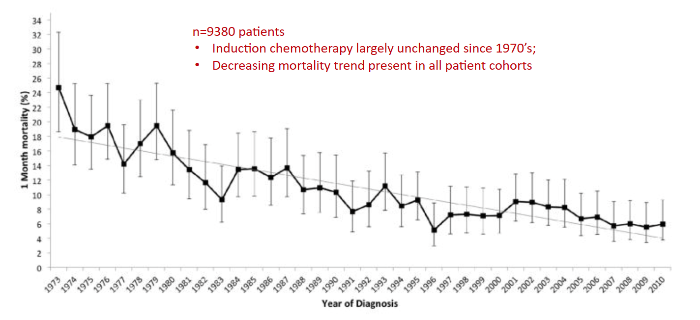{fig-align="center" width="800"}

- Induction chemotherapy largely unchanged since the 1970s.
- Decreasing mortality trend present in **all** patient cohorts.

::: aside
[@percival2015]
:::

## Pillars of hemato-oncology treatment

<br>

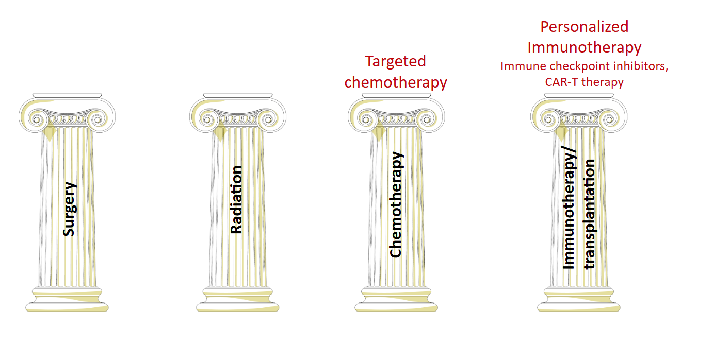{fig-align="center"}

# Pathogenesis and epidemiology {background-color="#b20e10"}

## Pathogenesis of infection during neutropenia

<br>

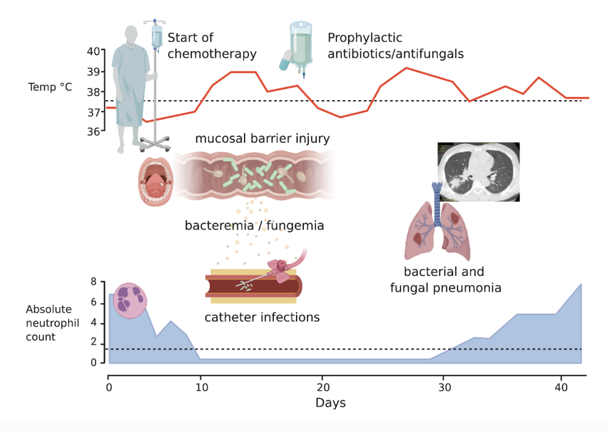{fig-align="center" width="750"}

## Chemotherapy-associated dysbiosis <br>and mucosal barrier injury

<br>

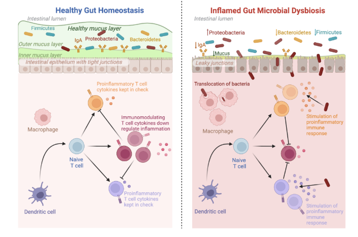{fig-align="center"}

## Mucositis

<br>

**WHO oral toxicity scale**

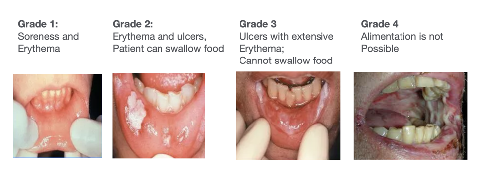

## GI tract is the major source of bacteremia

<br>

::::: columns
::: {.column width="50%"}
**Gram-negative bacilli**

*Aerobic*

- *Pseudomonas aeruginosa*

*Facultatively anaerobic*

- *Escherichia coli*
- *Klebsiella pneumoniae*
- *Enterobacter cloacae*

*Capnophilic*

- *Capnocytophaga* species

*Anaerobic*

- *Fusobacterium* species
- *Leptotrichia buccalis*
- *Prevotella* species
:::

::: {.column width="50%"}
**Gram-positive cocci**

*Oral viridans streptococci*

- *Streptococcus mitis*
- *Streptococcus oralis*
- *Streptococcus sanguis*

*Staphylococci*

- *Staphylococcus epidermidis*

*Others*

- *Stomatococcus mucilaginosus*
:::
:::::

## Causes of fever complicating induction chemotherapy

<br>

{fig-align="center" width="600"}

## Vesicular lesions, mucosal ulcers and thrush

<br>

**HSV / VZV reactivation and *Candida* mucosal infections**

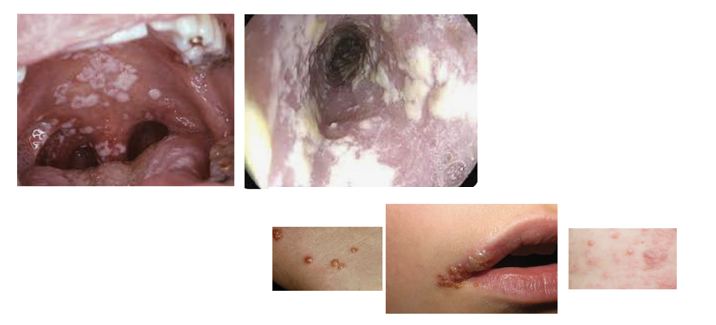{fig-align="center"}

## Skin lesions in neutropenic patients

<br>

{fig-align="center"}

## Ecthyma gangrenosum lesions

<br>

{fig-align="center"}

::: callout-tip
**Biopsy!**
:::

## *Clostridium difficile* and neutropenic colitis {.smaller}

{fig-align="center" width="350"}

<br>

- Diarrhea is common --- both infectious and non-infectious causes
  - Chemotherapy-associated mucosal injury
  - Neutropenic enterocolitis
  - Drugs (e.g., oral magnesium supplements)
- *C. difficile*-associated diarrhea (CDAD): incidence 10--30% in some
  studies
- Oral vancomycin, fidaxomicin \> metronidazole
- Limited data for FMT, bezlotoxumab

::: aside
[@alonso2012]
:::

## Pathogenesis of infection during neutropenia

<br>

{fig-align="center" width="800"}

------------------------------------------------------------------------

## Lung infiltrates in leukemia patients

<br>

<center>**Urgent CT imaging needed!**</center>

{fig-align="center" width="800"}

## Bronchoscopy: timing is critical

<br>

<center>**Early microbiological diagnosis is associated with improved
mortality**</center>

{fig-align="center"}

## Infection risk versus duration of neutropenia

<br>

:::::: columns
::: {.column width="33%"}
**Phase I (1--10 days)**

- Herpes simplex
- ± *Candida*
:::

::: {.column width="33%"}
**Phase II (10--27 days)**

- CoNS *Staphylococcus*
- Enterobacteriaceae
- Viridans streptococci
- Anaerobes
- *Enterococcus*
- *C. difficile*
- Herpes simplex / *Candida*
:::

::: {.column width="33%"}
**Phase III (\>27 days)**

- MRSA
- VRE
- Resistant GNR
- *S. maltophilia*
- Invasive moulds
:::
::::::

::: aside
[@safdar2001]
:::

## BLI combination comparison

<br>

| Feature           | Ceftolozane-Tazobactam | Ceftaz-Avibactam | Cefiderocol |
|-------------------|------------------------|------------------|-------------|
| MDR *Pseudomonas* | ++++                   | ++               | +++         |
| ESBL              | +++                    | ++++             | +++         |
| KPC               | \-                     | ++++             | +++         |
| MBL               | \-                     | \-               | ++          |
| OXA-48            | \-                     | ++++             | +++         |
| *Acinetobacter*   | \+                     | \+               | ++++        |

::: aside
Agent selection depends on the specific resistance mechanism present.
:::

## Rectal swab to detect MDR colonization

<br>

Rectal swab surveillance identifies patients at highest risk of
MDR-related bloodstream infection (BSI) during neutropenia.

| Feature | ESBL-*E* | CR-*Klebsiella* (KPC) | MDR *P. aeruginosa* |
|------------------|------------------|------------------|------------------|
| **Prevalence at admission** (HM inpatients) | Most common MDR-GNB | \~3–6% in high-endemicity areas | Variable; rising in Italy and SE Europe |
| **Colonization → concordant BSI** | \~14–16% | \~14% | Up to 20–25% |
| **BSI occurs mainly during…** | Neutropenia (87% of cases) | Neutropenia | Neutropenia / mucositis |
| **3-month overall survival** (colonized) | 96.8% | 83.6% | High mortality if inadequate therapy |
| **Empiric therapy modification** | Carbapenem | Ceftazidime/avibactam or meropenem/vaborbactam | Ceftolozane/tazobactam or ceftazidime/avibactam |

<br>

::: callout-important
**Risk of MDR-related BSI is \~38-fold higher** in rectal carriers vs.
non-colonized patients. Weekly rectal surveillance in high-risk wards
enables pathogen-directed empiric therapy and antibiotic stewardship.
:::

::: aside
[@cattaneo2018; @luo2024; @gallardo2025; @baccelli2025]
:::

<br>

## *P. aeruginosa* ST175 and ST23 outbreak in the hematology ward in Bologna

{fig-align="center" width="650"}

Required temporary suspension of admissions and cleaning of water
systems and traps.

::: aside
[@coppola2020]
:::

# Is fluoroquinolone prophylaxis <br> still useful? {background-color="#b20e10"}

## Is fluoroquinolone prophylaxis still useful?

<br>

**International guidelines on FQ prophylaxis**

| Author, Year | Organization | Population | Recommendation |
|------------------|------------------|------------------|------------------|
| Bucaneve, 2007 | ECIL-1 | NP, high-risk | ✅ FQP recommended |
| Freifeld, 2011 | IDSA | NP, high-risk | ✅ FQP recommended |
| Slavin, 2011 | Victorian Integrated Cancer Services, Australia | NP, high-risk | ⚠️ FQP **not** recommended (lack of mortality benefit; resistance risk) |
| Baden, 2012 | NCCN | NP, high-risk | ✅ FQP recommended |
| NICE, 2012 | NICE | NP, high-risk | ✅ FQP recommended |
| Klastersky, 2016 | ESMO | NP, high-risk | ⚠️ FQP **not** recommended |
| Taplitz, 2018 | ASCO/IDSA | NP, high-risk | ✅ FQP recommended |
| Mikulska, 2018 | ECIL, EBMT, EORTC, ICHS, ELN | NP, high-risk | 🔵 Consider locally whether benefits on BSI/FN outweigh resistance and toxicity risks |
| Christopeit, 2021 | AGIHO | HDC and auto-HSCT | 🔵 Weigh expected benefits against risks (local epidemiology and individual patient factors) |

NP, neutropenic patients; HDC, high-dose chemotherapy; FQP,
fluoroquinolone prophylaxis.

## Do all patients benefit from FQ prophylaxis / BSI reduction?

<br>

**Prospective study (4 223 alloHSCT, 3 602 autoHSCT, 930 acute leukemia
on HDS, 2009--2014)**

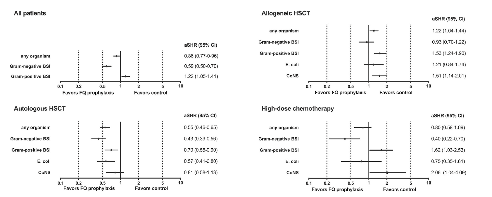{fig-align="center"}

::: aside
[@kern2018]
:::

## FQ-resistant *Enterobacterales* colonization reduces FQ-prophylaxis effectiveness

<br>

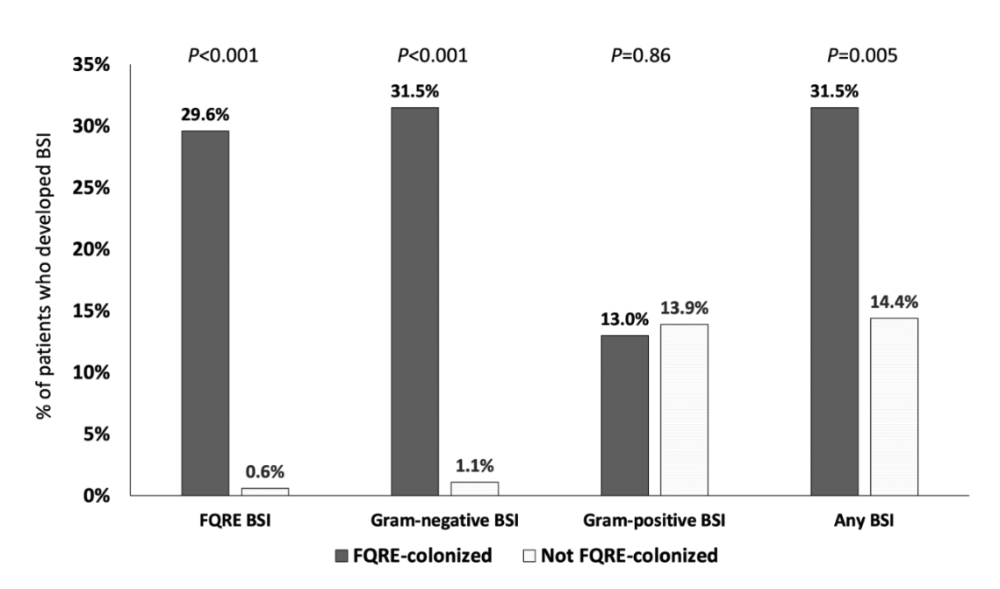{fig-align="center" width="800"}

::: aside
[@satlin2021]
:::

## Squeezing the resistance balloon

<br>

{fig-align="center" width="350"}

1.  Chemotherapy- and antibiotic-associated dysbiosis
2.  Fluoroquinolone prophylaxis
3.  ESBL colonization
4.  Empiric carbapenem therapy to cover ESBLs
5.  Colonization with carbapenem-producing *Enterobacterales*
6.  **Carbapenem-resistant bloodstream infections**

::: aside
ECIL-10 systematic review confirms a **south-eastern European resistance
gradient** and a significant temporal increase in ESBL/3GCR, CR *K.
pneumoniae*, and MDR *P. aeruginosa* over the past decade.
[@baccelli2025]
:::

## To give or not to give fluoroquinolone prophylaxis?

<br>

::::: columns
::: {.column width="50%"}
**Why YES?**

- Less neutropenic fever events
- Less bloodstream infections
:::

::: {.column width="50%"}
**Why NO?**

- No difference in mortality?
- Reduced efficacy in high-resistance settings
- Infection with MDR and FQ-resistant bacteria
- Adverse events (↑ QTc, etc.)
- *Clostridium difficile*
- Effect on gut microbiota
:::
:::::

::: callout-note
*But*… effect depends on FQ-resistance rate, FQR colonization, FQ type,
and underlying disease.
:::

## What is the future?

<br>

- Personal approach directed by **screening** (not universal
  prophylaxis)
- Improved sepsis diagnosis and management
- Individual risk score (Big data)
- RCTs in high-resistance locations
- Additional data on outcomes (CDI, resistance emergence, microbiome
  changes)

::: aside
[@slavin2019]
:::

# How long to treat?

**Classic dogma:** continue antibiotics until resolution of neutrophil
count *irrespective* of fever response.

## "How Long" study

<br>

<!-- IMAGE: insert How-Long trial design / outcomes figure -->

::: aside
[@aguilar2017]
:::

## "How Long": key findings

<br>

- FUO patients afebrile and clinically stable for 72 h after start of
  empiric therapy could safely stop antimicrobial therapy
- No difference in mortality, subsequent BSI or recurrent fever between
  intervention and control arms
- Antimicrobial-free days significantly higher in intervention arm
  (median 16.1 vs. 13.6 days)
- However, few alloHSCT patients enrolled
- Average duration of fever in intervention group: 24 h

::: aside
[@aguilar2017]
:::

## De-escalating empiric antimicrobial therapy

<br>

**2011 4th European Conference on Infections in Leukemia
recommendations**

::::: columns
::: {.column width="50%"}
**Patient stable at presentation and 76--96 h later**

*Afebrile (FUO):*

- Reevaluate appropriateness of antibiotic regimens
- Consider stopping aminoglycoside, fluoroquinolone, or Gram-positive
  agents
- Continue current β-lactam or consider switch to narrow-spectrum agent

*Clinically-documented infection:*

- Reevaluate antibiotic regimens
- Stop aminoglycosides, quinolone or Gram-positive agent if combined
- Switch to narrower spectrum if sensitive
- Consider stopping antibiotic treatment at ≥72 h if afebrile ≥48 h
- Complicated vs. uncomplicated infection!
:::

::: {.column width="50%"}
**Patient deteriorating**

*Febrile:*

- Diagnostic work-up
- Consider resistant Gram-negative; empiric addition of colistin or
  other broader-spectrum agent
- Consider resistant Gram-positive pathogen; add appropriate therapy
- Consider fungal, viral, and other etiologies of deterioration

*Afebrile:*

- Diagnostic work-up
- Consider fungal and other atypical pathogens
:::
:::::

::: aside
FUO, fever of unknown origin.

[@averbuch2013]
:::

## Real-world implementation of early de-escalation

<br>

```{=html}
<div style="font-family: Arial, sans-serif; font-size: 0.75em; max-width: 820px; margin: 0 auto;">

  <!-- Row 1: Empiric therapy -->
  <div style="display:flex; gap:8px; align-items:stretch;">

    <div style="flex:1; border:1.5px solid #888; background:#f0f0f0; padding:8px 10px; border-radius:4px;">
      <strong>Empiric therapy (high-risk febrile neutropenia)</strong><br>
      <span style="color:#c00;"><strong>Amikacin</strong></span> 15 mg/kg/d IV — stop after 3 days if no MDR<br>
      <span style="color:#c00;"><strong>Meropenem</strong></span> 3 × 1 g/d IV (extended infusion 3 h)
    </div>

    <div style="display:flex; flex-direction:column; justify-content:center; align-items:center; font-size:1.1em; color:#444; min-width:24px;">→</div>

    <div style="flex:1; border:1.5px solid #c0706a; background:#fde8e3; padding:8px 10px; border-radius:4px;">
      <strong>Add vancomycin if:</strong>
      <ul style="margin:4px 0 0 0; padding-left:1.2em;">
        <li>Gram+ blood cultures (≥ 2 sets)</li>
        <li>Catheter-related infection</li>
        <li>Skin / soft-tissue infection</li>
        <li>MRSA colonization</li>
      </ul>
      <div style="margin-top:4px; font-size:0.9em; color:#555;">Loading 20 mg/kg → maintenance per CrCl/TDM · stop amikacin</div>
    </div>

  </div>

  <!-- Arrow down -->
  <div style="text-align:center; font-size:1.3em; color:#444; line-height:1.4;">↓ &nbsp;<span style="font-size:0.7em; color:#666;">reassess every 24 h</span></div>

  <!-- Row 2: Three outcome branches -->
  <div style="display:flex; gap:8px; align-items:stretch;">

    <div style="flex:1; border:1.5px solid #5a7abf; background:#dce7f7; padding:8px 10px; border-radius:4px;">
      <strong>Microbiologically<br>documented infection</strong><br>
      <em>De-escalate</em> per resistance profile<br><br>
      <em>Stop</em> after ≥ 7 days total,<br>≥ 4 days afebrile, pathogen eradicated
    </div>

    <div style="flex:1; border:1.5px solid #5a9a5a; background:#e6f4e6; padding:8px 10px; border-radius:4px;">
      <strong>Clinically documented<br>infection</strong><br>
      <em>Stop</em> when all signs resolved,<br>≥ 7 days total, ≥ 4 days afebrile<br><br>
      <span style="font-size:0.9em;"><em>Pulmonary aspergillosis:</em> stop antibiotics if stable + &gt; 48 h afebrile on antifungal</span>
    </div>

    <div style="flex:1; border:1.5px solid #c09020; background:#fef5dc; padding:8px 10px; border-radius:4px;">
      <strong>Fever of unknown<br>origin (FUO)</strong><br>
      <em>Stop</em> after ≥ 72 h if clinically stable and afebrile ≥ 48 h<br><br>
      <span style="font-size:0.9em;">No documented focus required</span>
    </div>

  </div>

  <!-- Footer note -->
  <div style="margin-top:7px; border:1px solid #bbb; background:#f9f9f9; padding:6px 10px; border-radius:4px; font-size:0.88em; color:#333; text-align:center;">
    In case of <strong>fever relapse</strong>, reinitiate empiric therapy and draw blood cultures before restarting antibiotics.
  </div>
```

<br> <br>

- Rate of alloHSCT: 28%
- Clinical failure rates were similar between arms; **higher rate of BSI
  in the post-implementation group**

::: aside
[@verlinden2022]
:::

# Unique infection risks with other immunosuppressive therapies {background-color="#b20e10"}

## "Net state of immunosuppression"

<br>

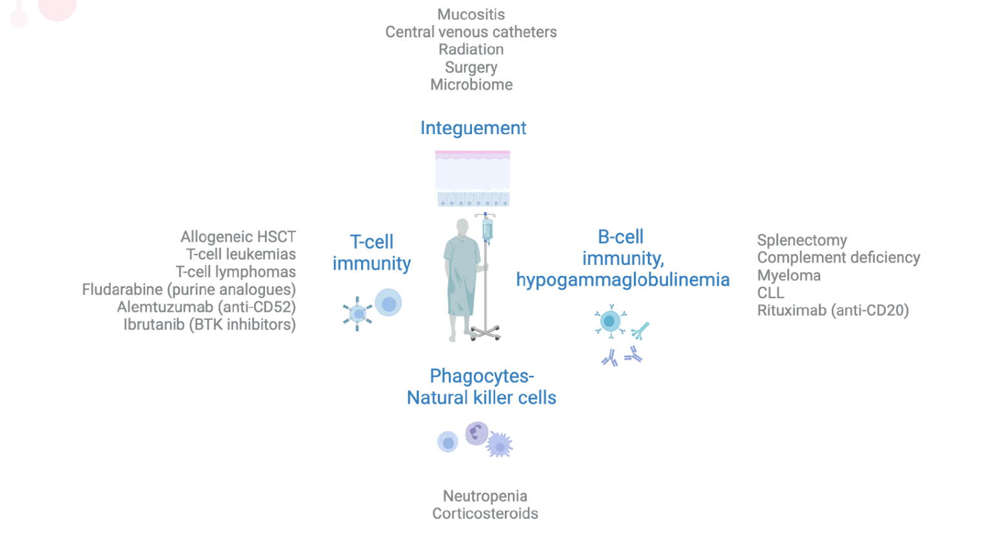{fig-align="center"}

## Corticosteroids

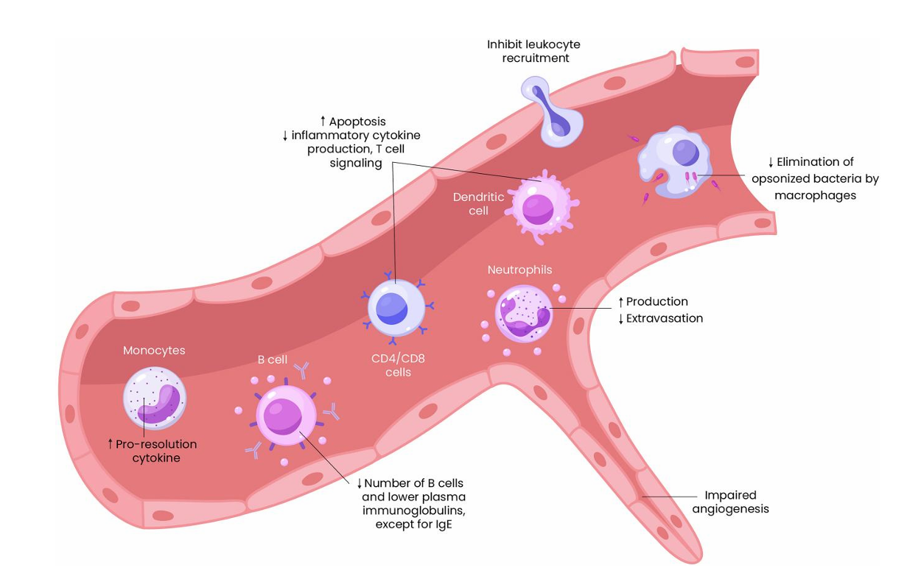{fig-align="center"}

<br>

**The "credit cards" of immunosuppression**

::: aside
[@chastain2023]
:::

## Suppressed cell-mediated immunity {.smaller}

<br>

::::: columns
::: {.column width="50%"}
**Macrophages, CD4⁺ T-helper lymphocytes**

*Intracellular bacteria*

- *Mycobacterium tuberculosis*
- Atypical mycobacteria
- *Legionella* spp.
- *Listeria monocytogenes*
- *Salmonella typhi*
- *Nocardia* spp.

*Fungi*

- *Candida* spp.
- Rare yeast (echinocandin-resistant)
- Endemic fungi
- *Cryptococcus*
- *P. jirovecii*
- Molds

*Parasites*

- *Toxoplasma gondii*
- *Cryptosporidium*
- *Leishmania*
:::

::: {.column width="50%"}
**CD8⁺ cytotoxic T-cells**

*Viruses*

- Herpes simplex
- Varicella zoster
- Cytomegalovirus
- HHV-6
- Epstein-Barr
- Adenovirus
- Polyomaviruses
- Influenza
- Para-influenza
- RSV
:::
:::::

::: aside
Drugs that suppress cell-mediated immunity: purine analogues (e.g.,
fludarabine, 2-CDA, clofarabine), alemtuzumab, corticosteroids (\>20 mg
prednisone equivalent for \>2 weeks), TNF-α inhibitors…
:::

## Leukemia progress: expansion of targeted therapies {.smaller}

<br>

| Disease | Current/future therapies | 5--10 yr survival |
|------------------------|------------------------|------------------------|
| Hairy-cell leukemia | Cladribine + rituximab | 90% |
| Acute promyelocytic leukemia | ATRA ± gemtuzumab ozogamicin (GO) | 80--90% |
| Core-binding-factor AML | FLAG-GO ± IDA; alloHSCT if MRD-positive | 80--90% |
| AML, younger / fit | FLAG-IDA + venetoclax; CLIA + venetoclax; FLT3/IDH inhibitors; HMA-based maintenance ± menin inhibitors | 50--60%+ |
| AML, older / unfit | Low-intensity triple nucleosides (cladribine, cytarabine, HMAs) + venetoclax; HMAs + venetoclax + targeted therapies | 40--50%? |
| ALL \<60 y | Hyper-CVAD + CD19/CD22/CD20 antibodies | 60--70% |
| ALL \>60 y | Mini-Hyper-CVAD, inotuzumab, blinatumomab | 50% |
| Ph⁺ ALL | Hyper-CVAD + ponatinib; ponatinib + blinatumomab | 70--80%? |
| CML | BCR-ABL1 TKIs (imatinib, dasatinib, bosutinib, nilotinib, ponatinib); alloHSCT | 85--90% |
| CLL | Ibrutinib / other BTKi (acalabrutinib, zanubrutinib, pirtobrutinib) | 80--90%+ |
| Higher-risk MDS | Parenteral / oral HMAs, venetoclax, others | 40%+ |

::: aside
[@kantarjian2021lh; @kantarjian2021cancer]
:::

------------------------------------------------------------------------

## Unexpected consequences?

<br>

**Ibrutinib: Bruton's tyrosine kinase (BTK) inhibitor**

**RESONATE-2 Trial (frontline ibrutinib for CLL)**

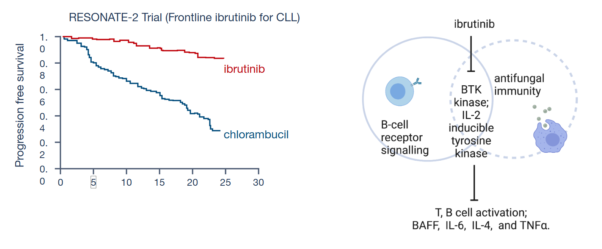{fig-align="center" width="800"}

|                 | Ibrutinib                       | Chlorambucil |
|-----------------|---------------------------------|--------------|
| Median survival | 18.9 mo                         | NR           |
| HR              | 0.16 (0.09--0.28); *P* \< 0.001 |              |

::: aside
[@burger2015]
:::

------------------------------------------------------------------------

## Aspergillosis associated with ibrutinib treatment

<br>

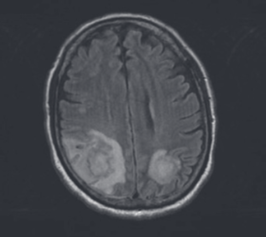{fig-align="center"}

- Retrospective French surveillance (FILO): 33 cases of aspergillosis in
  ibrutinib-treated CLL patients
- CNS aspergillosis in 11/27 (40%); most cases within 3 months of
  starting ibrutinib
- All patients had refractory/relapsed disease and additional
  predisposing factors (e.g., steroids in 7, neutropenia in 5)
- T2-FLAIR MRI showing multiple cerebral abscesses

::: aside
[@ghez2018; @chamilos2018]
:::

------------------------------------------------------------------------

## Fungal infections in patients receiving ibrutinib for lymphoid cancers

<br>

::::: columns
::: {.column width="50%"}
**MDACC retrospective (2014--2018), *n* = 841**

- 21 (2.5%) with proven/probable IFI
- Mostly pneumonia
- Primary fungus: *Aspergillus*
- IFI risk factors:
  - Monocytopenia (OR 6.00)
  - ≥3 prior CLL therapies (OR 5.36)
:::

::: {.column width="50%"}
**MSKCC experience, *n* = 378**

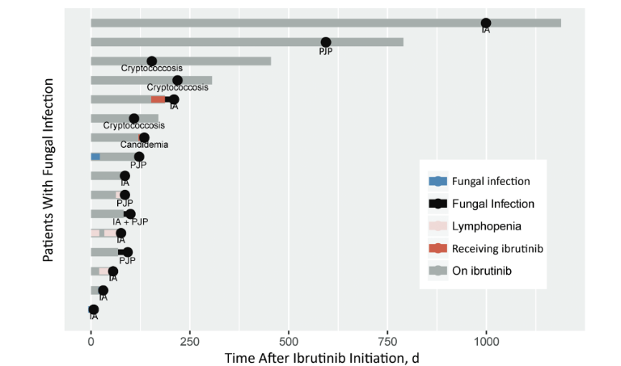{fig-align="center" width="400"}

- 62.5% of subjects lacked "classical" risk factors for fungal
  infection.
:::
:::::

::: aside
[@varughese2018; @frei2020]
:::

------------------------------------------------------------------------

## Ibrutinib for steroid-refractory cGVHD

<br>

In the pivotal phase 1/2b studies, the most common adverse events were
fatigue, diarrhea, muscle spasms, nausea, and bruising; relatively low
incidence (18%) of pneumonia and only 1 case related to aspergillosis.

Limited "real-life" experience suggests higher rates of invasive fungal
disease for steroid-refractory cGVHD:

- Overall response in SR-cGVHD: 9/11 (82%)
- Infections: 6/11 (55%)
- Possible/proven invasive aspergillosis: 4/11 (36%)

::: aside
[@waller2019; @miklos2017; @kaloyannidis2021]
:::

------------------------------------------------------------------------

## Invasive fungal infection risk with targeted therapies

<br>

| Class | Relative IA incidence | Antifungal-prophylaxis / DDI considerations |
|------------------------|------------------------|------------------------|
| BiTE (blinatumomab) | Higher if post-alloHSCT, prolonged neutropenia, or CR — risk factors not reported | No known drug interactions |
| FLT3 inhibitors (midostaurin, gilteritinib) | No clear ↑ post-alloHSCT? | Avoid strong CYP3A4 inhibitors; ↑ 2--10-fold AUC with itraconazole; monitor QTc; posaconazole or isavuconazole with TDM; no routine dose adjustment |
| PI3Kδ (idelalisib) | ↑ risk of CMV, PJP, aspergillosis? | Avoid strong CYP3A4 inhibitors; ↑ 1.8-fold AUC with ketoconazole; monitor for toxicity |
| IDH 1/2 (ivosidenib, enasidenib) | No clear ↑ infection; distinguish infection from differentiation syndrome | Avoid strong CYP3A4 inhibitors; ↑ 2.7-fold AUC with itraconazole; monitor QTc |
| BCL-2 (venetoclax) | Possible ↑ risk (prolonged cytopenia) without prophylaxis | Dose-reduce venetoclax \>50--75% if azole indicated; ↑ 8.8-fold AUC with posaconazole |
| HMAs (azacytidine, decitabine) | Lower in newly-treated patients; higher in refractory disease | Antifungal prophylaxis may not be needed initially; no triazole interactions |
| Hedgehog inhibitor (glasdegib) | No data | Avoid with azole; monitor QTc |

::: aside
[@logan2020]
:::

------------------------------------------------------------------------

## Adverse-effect monitoring: toxicities of small-molecule inhibitors (SMIs)

<br>

<!-- IMAGE: insert SMI toxicity overview figure -->

::: callout-warning
Differential diagnosis should always include drug interactions in
patients on triazoles.
:::

::: aside
[@wang2020]
:::

------------------------------------------------------------------------

## Chimeric antigen receptor T-cell therapy

<br>

<!-- IMAGE: insert CAR-T therapy overview schematic -->

------------------------------------------------------------------------

## Infection risk with CAR-T therapy

<br>

<!-- IMAGE: insert CAR-T timeline of infection risks (Day -5 → Day 75) -->

- Lymphodepleting chemotherapy (cyclophosphamide, fludarabine) → mucosal
  damage
- CAR-T cells → cytokine release syndrome (CRS), ICANS
- Tocilizumab (anti-IL-6), corticosteroids
- Underlying disease and prior therapies → lymphopenia,
  hypogammaglobulinemia, neutropenia
- Risk windows:
  - **Bacterial infections** early
  - **Viral infections** through neutropenia recovery
  - **Fungal and other opportunistic infections** with prolonged
    neutropenia or corticosteroids

::: aside
[@gudiol2021]
:::

------------------------------------------------------------------------

## Checkpoint inhibitors

<br>

**Toxicities may overlap with symptoms of infection.**

<!-- IMAGE: insert ICI organ-toxicity figure -->

::: aside
[@martins2019]
:::

------------------------------------------------------------------------

## Opportunistic infections during ICI / IRAE management

<br>

Retrospective study of 740 melanoma patients at MSKCC (2010--2014)
receiving immune checkpoint blockers:

- Serious infection in 54 (7.3%); fungal infection in 6 (PJP 3, IPA 2)
- Average time to infection: 135 days; 80% within 6 months
- Risk factors: corticosteroids (OR 7.71), infliximab (OR 4.74)
- Combination ipilimumab + nivolumab: ↑ risk; pembrolizumab inversely
  associated

::: aside
[@delcastillo2016; @kyi2014; @arriola2015; @uslu2015]
:::

# Invasive fungal infections

------------------------------------------------------------------------

## Problem: non-specificity of CT findings

<br>

<!-- IMAGE: insert grid of CT images labeled with potential etiologies -->

Possible causes of similar CT appearance: *P. aeruginosa* ·
*Aspergillus* · *K. pneumoniae* · mould · CMV · *Cryptococcus* ·
lymphoma · *Nocardia*

------------------------------------------------------------------------

## EORTC/MSG definitions of invasive fungal disease

<br>

**Epidemiology use only**

| Category | Required evidence |
|------------------------------------|------------------------------------|
| **Proven** | Direct evidence of fungal tissue invasion |
| **Probable** | Host factors + clinical factors + indirect mycological evidence (e.g., galactomannan) |
| **Possible** | Host factors + clinical factors |

::: aside
[@donnelly2019]
:::

------------------------------------------------------------------------

## CT pulmonary angiography (CTPA) to improve specificity for invasive mold disease

<br>

**Fungal angioinvasion and vessel thrombosis**

<!-- IMAGE: insert CTPA with vessel-occlusion sign panel -->

::: aside
[@sonnet2005; @stergiopoulou2007; @bergeron2012]
:::

------------------------------------------------------------------------

## CTPA distinguishes mold vs. bacterial pneumonia in acute leukemia

<br>

<!-- IMAGE: insert VOS-positive vs. VOS-negative CT panel -->

- **VOS positive:** proven mold disease by autopsy
- **VOS negative:** bacterial pneumonia
- VOS = vessel occlusion sign

::: aside
[@stanzani2012]
:::

------------------------------------------------------------------------

## CTPA: case examples

<br>

<!-- IMAGE: insert paired clinical CTPA cases -->

- AML consolidation; neutropenia; posaconazole prophylaxis; serum GM
  negative → BAL: galactomannan 1.5 (VOS +)
- Resistant CML; neutropenia; posaconazole prophylaxis; serum GM
  negative → BAL: MDR *P. aeruginosa* +, GM − (VOS −)

------------------------------------------------------------------------

## PET/CT imaging: more useful for follow-up and detecting dissemination?

<br>

```{=html}
<!-- IMAGE: insert ¹⁸F-FDG-PET/CT panels (sino-orbital aspergillosis,
disseminated scedosporiosis, pulmonary aspergillus pre/post antifungal) -->
```

Selected ¹⁸F-FDG PET/CT images illustrating appearances of invasive
fungal infection: (a) sino-orbital infection with *Aspergillus*; (b)
disseminated scedosporiosis with avid splenic lesion; (c) pulmonary
*Aspergillus* lesion in left lower lobe with discordant PET/CT and CT
response after antifungal treatment.

------------------------------------------------------------------------

## Fungal sinusitis / pneumonia: breakthrough infections on prophylaxis

<br>

<!-- IMAGE: insert clinical / radiographic / micrographic panel -->

Possible etiologies on prophylaxis breakthrough:

- Resistant *Aspergillus*?
- Mucorales
- *Fusarium* spp.
- *Scedosporium* spp.
- Rare yeast (e.g., *Saprochaete clavata*)

::: aside
[@stanzani2019]
:::

------------------------------------------------------------------------

## Invasive mucormycosis

<br>

<!-- IMAGE: insert mucormycosis clinical / radiographic panel -->

------------------------------------------------------------------------

## CT-specific findings for mucormycosis?

<br>

<!-- IMAGE: insert mucormycosis CT panel -->

- Multiple bilateral nodular infiltrates

# Final thoughts: what to do with persistent fever?

------------------------------------------------------------------------

## Persistent fevers --- what to do?

<br>

- **Wrong bug** (viruses? atypicals? *fungi*!)
- **Wrong drug** (MDR pathogen?)
- **Wrong process** (malignancy, transfusions, contrast, allergy, etc.)
- **No source control** (endocarditis? CLABSI, osteomyelitis,
  liver/abdominal abscess)
- **Not enough time?**

------------------------------------------------------------------------

## Defervescence after start of effective antibiotics in neutropenic patients

<br>

<!-- IMAGE: insert time-to-defervescence curve -->

::: aside
[@depauw1994; @ramphal1992]
:::

------------------------------------------------------------------------

## Summary

<br>

**Febrile neutropenia: infections in patients with hematological
malignancies**

- Despite new targeted treatments and immunotherapy, principles of
  infection management --- especially empiric therapy --- are largely
  unchanged.
- Increasing focus on **earlier discontinuation** of therapy in
  afebrile, clinically stable patients.
- Imaging is progressing with **CT pulmonary angiography** and
  **FDG-PET** to support antibiotic stewardship; potential for *labeled
  PET* in the future.
- Unique risk for infections with novel therapies --- an epidemiological
  black box.

------------------------------------------------------------------------

## References {.smaller}

<br>

::: {#refs}
:::
